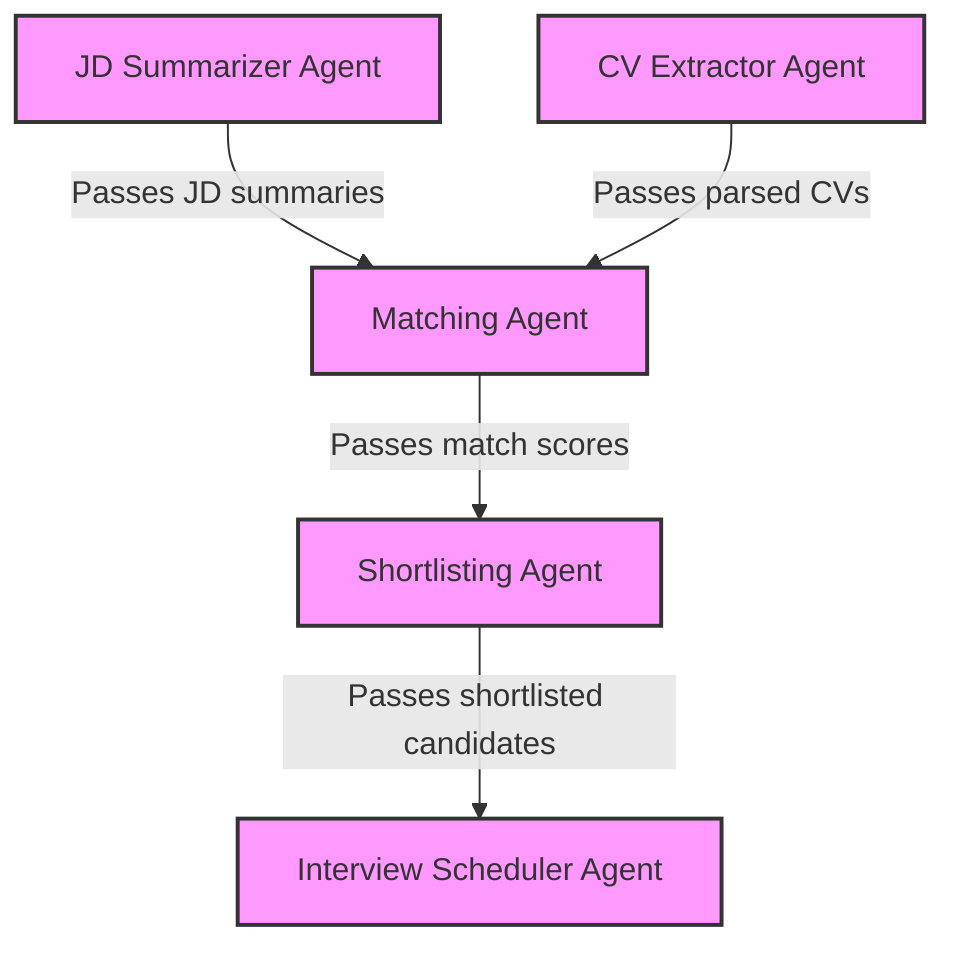

# Multi-Agent AI System for Job Screening

A complete Python system with multiple agents working together to enhance the job screening process.

## 🌟 Features

- **Job Description Summarizer Agent**: Parses JDs into structured data
- **CV Extractor Agent**: Extracts key information from PDF resumes
- **Matching Agent**: Uses embeddings to calculate match scores
- **Shortlisting Agent**: Automatically selects candidates with scores ≥ 80%
- **Interview Scheduler Agent**: Generates personalized interview emails
- **SQLite Memory Persistence**: Stores all data for future reference
- **Streamlit UI**: User-friendly interface for easy interaction

## 🗂️ Project Structure

```
project/
├── main.py                 # Main entry point
├── app.py                  # Streamlit UI
├── agents/                 # Agent modules
│   ├── jd_summarizer.py    # Parse and summarize job descriptions
│   ├── cv_extractor.py     # Extract structured data from resumes
│   ├── matcher.py          # Match JDs with CVs using embeddings
│   ├── shortlister.py      # Shortlist candidates based on score
│   └── emailer.py          # Send interview invitation emails
├── utils/                  # Utility modules
│   ├── embeddings.py       # Embedding generation and similarity
│   ├── parser.py           # Text parsing utilities
│   └── diagram.py          # Agent interaction diagram generator
├── db/                     # Database module
│   └── memory.py           # SQLite memory persistence
├── resumes/                # Resume PDF files
│   └── *.pdf               # Example resumes
├── job_description.csv     # Example job descriptions
└── README.md               # Project documentation
```


## 🤖 How It Works

1. **JD Summarizer Agent**:
   - Parses job descriptions from CSV file
   - Extracts structured data using Ollama or rule-based extraction
   - Stores in SQLite database

2. **CV Extractor Agent**:
   - Reads PDF resumes using PyMuPDF
   - Extracts name, email, phone, education, work experience, skills, etc.
   - Stores parsed data in database

3. **Matching Agent**:
   - Creates embeddings for JDs and CVs using Ollama's nomic-embed-text model
   - Calculates cosine similarity to get match scores
   - Stores scores in database

4. **Shortlisting Agent**:
   - Filters candidates with scores above threshold (default: 80%)
   - Generates shortlist for each job
   - Stores shortlisted candidates in database

5. **Interview Scheduler Agent**:
   - Generates personalized emails for shortlisted candidates
   - Highlights matched skills from the candidate's resume
   - Simulates or sends emails using SMTP

6. **Database Module**:
   - Stores all data for persistence across runs
   - Enables querying and reporting

## 📝 Dependencies

- `ollama`: For embedding generation
- `pymupdf`: For PDF parsing
- `numpy`, `scikit-learn`: For vector operations and similarity calculation
- `matplotlib`, `networkx`: For diagram generation 
- `sqlite3`: For database operations
- `streamlit`, `pandas`: For UI and data visualization

## 📊 Agent Interaction Diagram


